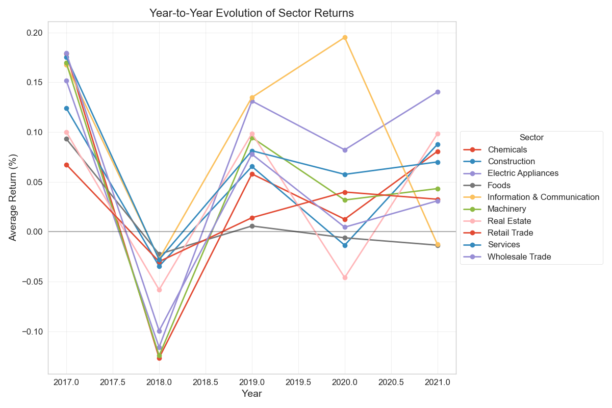
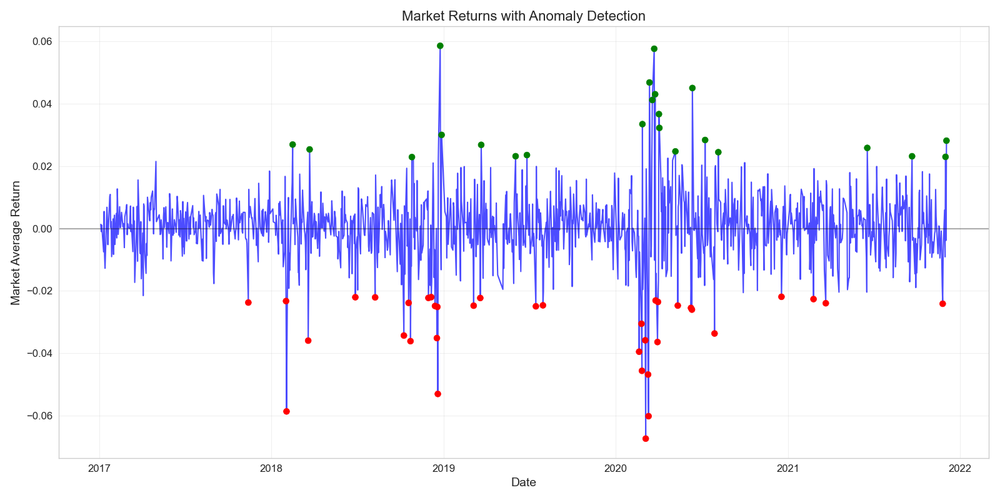
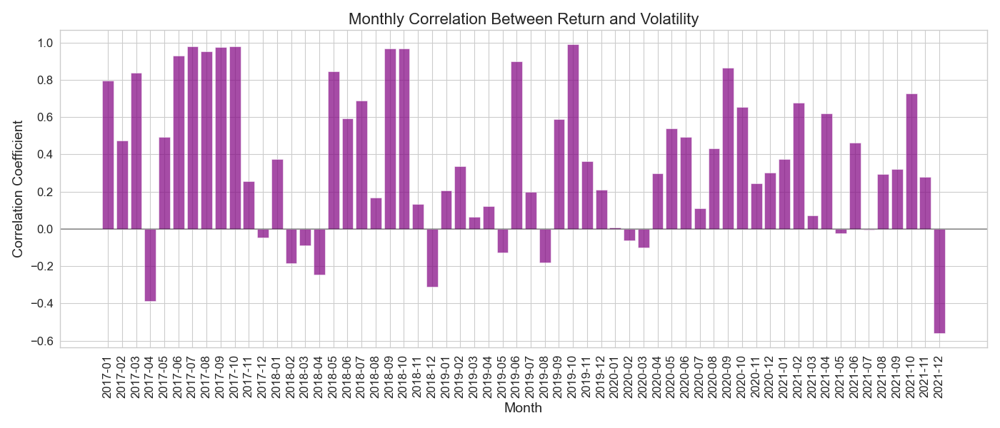
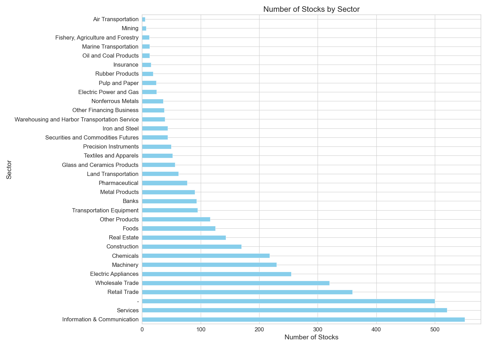
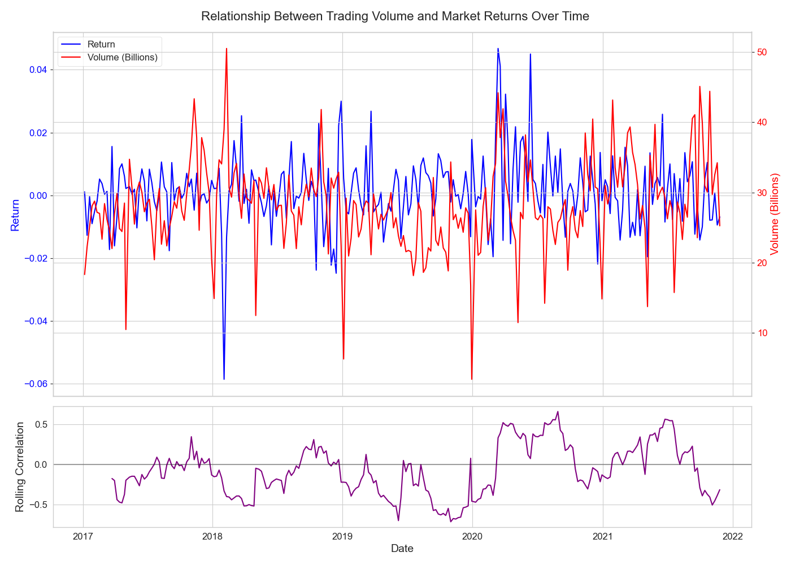
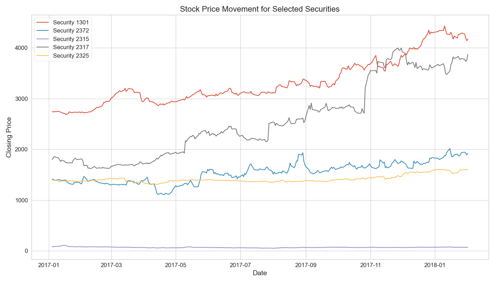
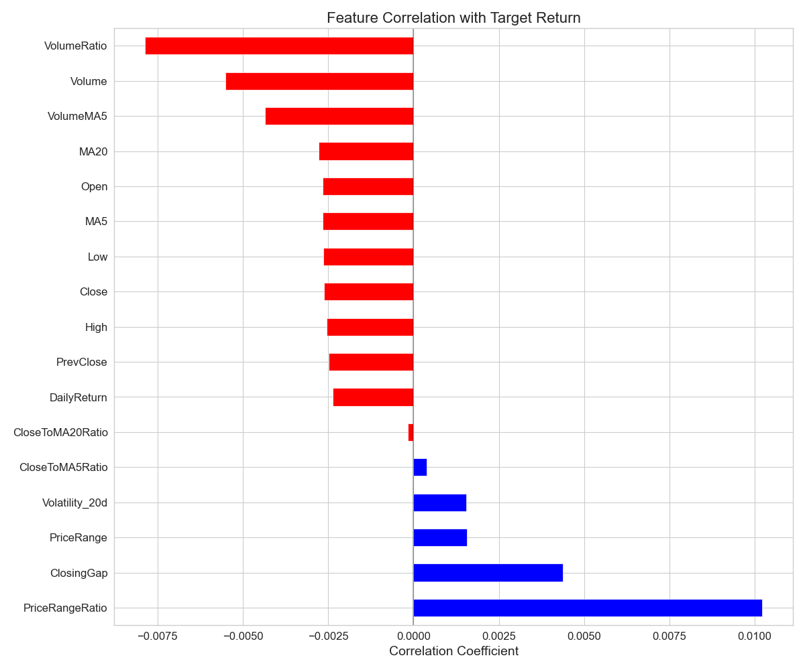
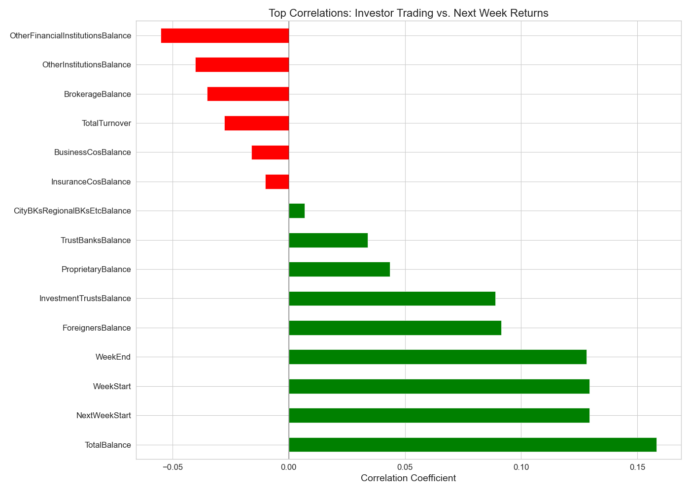
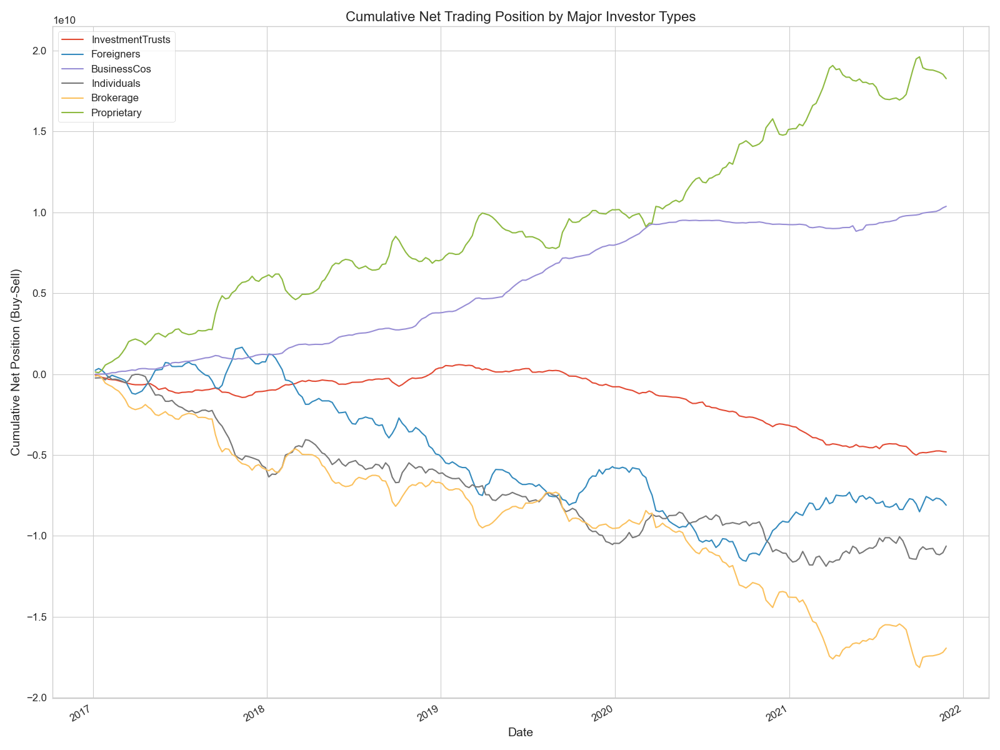

# JPX Tokyo Stock Exchange Prediction

## Project Overview

This project explores and analyzes data from the JPX Tokyo Stock Exchange with the goal of predicting future stock returns. Through comprehensive data analysis and visualization, we uncover patterns, relationships, and anomalies in the Japanese stock market that can be leveraged for investment strategies and predictive modeling.

The data is provided by the [JPX Tokyo Stock Exchange Prediction Competition on Kaggle](https://www.kaggle.com/competitions/jpx-tokyo-stock-exchange-prediction/overview), which challenges participants to build models that can predict stock returns for selected Japanese stocks.

## Data Description

The dataset contains rich historical market data for Japanese equities:

- **stock_prices.csv**: Daily price data (open, high, low, close) for 2,000 commonly traded stocks
- **stock_list.csv**: Company information including sector classification and market segment
- **trades.csv**: Aggregated trading volumes by different investor types
- **financials.csv**: Quarterly financial reports
- **options.csv**: Options data for the broader market

## Methods Applied

Our analysis employs several advanced methods to extract insights from the data:

1. **Time-Aware Sampling**: Ensures even temporal coverage to avoid biased analysis
2. **Anomaly Detection**: Z-score based approach to identify unusual market events
3. **Correlation Analysis**: Rolling correlations to track changing relationships between stocks
4. **Temporal Pattern Analysis**: Identifies seasonal patterns and year-to-year evolution
5. **Volatility-Return Analysis**: Examines the changing relationship between risk and reward
6. **Sector Analysis**: Tracks performance and trends across different market sectors
7. **Trading Behavior Analysis**: Studies the impact of different investor types on market returns
8. **Feature Importance**: Identifies key predictive factors for stock returns

## Key Visualizations and Analyses

### Yearly Sector Returns

Different sectors show varying performance trends over the years. This visualization reveals how sector returns evolve year-over-year, highlighting potential sector rotation strategies. We can observe which sectors lead in bull markets and which show resilience during downturns. The data suggests that technology and healthcare sectors have shown relatively stronger performance in recent years, while traditional sectors like real estate have exhibited more volatility.

### Market Anomalies

This visualization identifies unusual market events where returns deviate significantly from normal patterns. Red dots indicate negative anomalies (market drops), while green dots show positive anomalies (market jumps). Several notable anomalies appear in early 2020, corresponding to the global COVID-19 market shock. These anomalies provide context for model performance and help identify periods where standard prediction approaches might fail. Trading strategies can be adjusted during these anomalous periods.

### Return-Volatility Correlation

This chart displays the evolving relationship between returns and volatility over time. The correlation between risk and reward is not static but varies across different market regimes. Periods of negative correlation suggest flight-to-safety scenarios, while positive correlation often indicates momentum-driven markets. Understanding this relationship is crucial for risk management and optimal portfolio construction.

### Sector Distribution

This visualization shows how stocks are distributed across different sectors in the Japanese market. The size of each segment represents the number of companies in that sector. This provides context on sector weightings and helps identify underrepresented or dominant sectors. The Japanese market shows a significant concentration in manufacturing, services, and technology, with relatively smaller representation in sectors like utilities and real estate.

### Volume-Return Relationship

This dual-chart analysis shows how trading volume relates to market returns over time. The top panel displays volume (red) against returns (blue), while the bottom panel shows their rolling correlation. High volume during price increases often indicates trend strength, while high volume during price decreases may signal capitulation. The correlation pattern reveals how this relationship evolves through different market phases.

### Stock Price Movement

This time series shows price movements for selected major stocks. The visualization helps identify common trends, divergences, and relative performance across different companies. It also highlights periods of high correlation (when stocks move together) versus periods of dispersion (when stock-specific factors dominate). Market-wide events affect most stocks simultaneously, while company-specific news creates divergences.

### Feature Importance

This chart ranks the relative importance of different features in predicting stock returns. Technical indicators, financial metrics, and market factors are evaluated based on their predictive power. Price momentum, trading volume, and volatility emerge as particularly strong predictors. This analysis guides feature selection for predictive models and highlights which market factors deserve closer attention for investment decisions.

### Investor Return Correlation

This visualization shows the correlation between different investor types' trading behavior and subsequent market returns. Foreign investors, institutional investors, and individual investors often display different patterns. The analysis reveals which investor groups tend to lead market movements versus those that tend to follow trends. Foreign investor flows show a particularly strong relationship with future returns in the Japanese market.

### Cumulative Investor Positions

This chart tracks the cumulative buying and selling by different investor types over time. It reveals long-term patterns in capital flows and potential market sentiment shifts. When institutional investors begin accumulating while individual investors sell, it often signals a potential market bottom. Conversely, when individuals buy heavily while institutions reduce positions, it may indicate market tops.

## Conclusion

The analysis reveals significant temporal patterns in the Japanese stock market, with varying correlations, sector performances, and market anomalies over time. Understanding these patterns and relationships can significantly improve predictive models and trading strategies. The complexity of market regimes and varying relationships between indicators underscores the importance of adaptive, time-aware approaches to stock return prediction.

